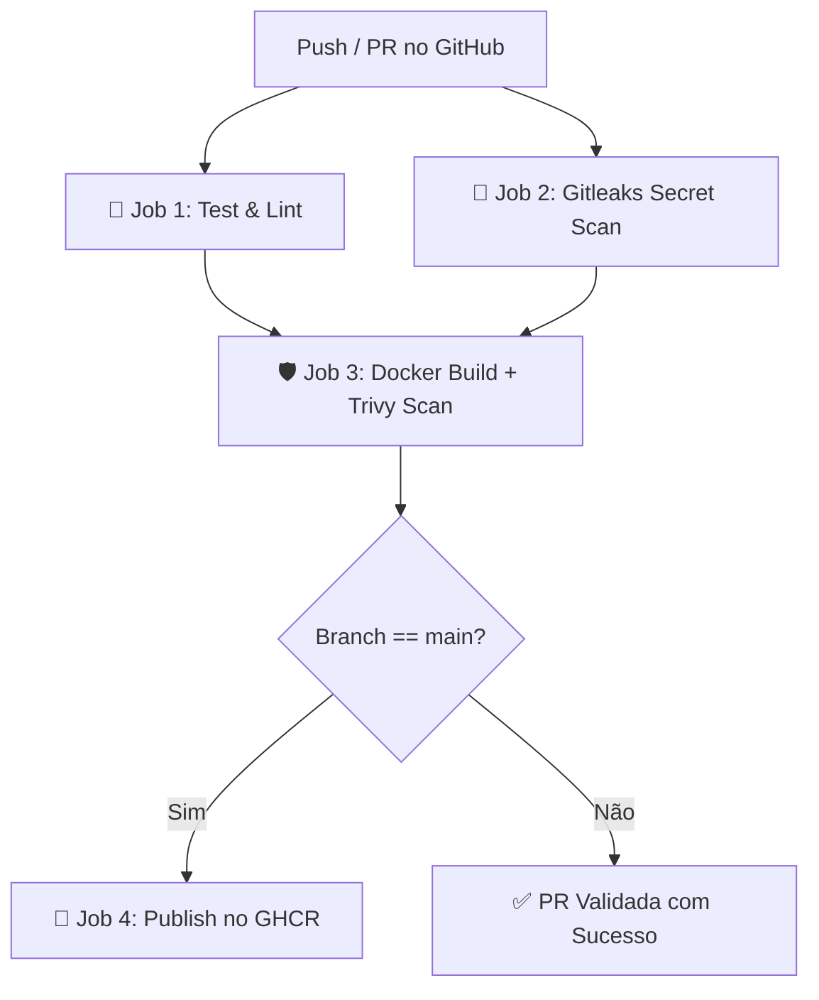

# 🚀 Enterprise DevSecOps CI/CD Pipeline

[](https://github.com/Casiati/devsecops-ci-cd-pipeline/actions/workflows/ci.yml)
[](https://opensource.org/licenses/MIT)
[](https://www.docker.com/)
[](https://trivy.dev/)
[](https://github.com/gitleaks/gitleaks)

Repositório modelo demonstrando a implementação de uma esteira completa de **CI/CD e DevSecOps** para microsserviços modernos, garantindo qualidade, segurança e entrega automatizada com **GitHub Actions** e **Docker**.

---

## 🏗️ Arquitetura do Pipeline



---

## 🔒 Pilares de Segurança (DevSecOps)

1. **Secret Scanning com Gitleaks**: Varredura automatizada em todo o histórico do commit para impedir vazamento acidental de tokens, chaves SSH e senhas.
2. **Container Security com Trivy**: Análise estática da imagem Docker gerada, detectando vulnerabilidades conhecidas (CVEs) em pacotes do sistema operacional e dependências da aplicação.
3. **Docker Multi-Stage Build**:
   - Imagem final enxuta baseada em `alpine`.
   - Execução com usuário sem privilégios de root (`USER node`).
   - `HEALTHCHECK` embutido para monitoramento do container em clusters (Kubernetes / ECS).

---

## 📦 Estrutura do Projeto

```text
├── .github/
│   └── workflows/
│       └── ci.yml              # Pipeline completo CI/CD + DevSecOps
├── src/
│   ├── app.js                  # Configuração dos endpoints e health checks
│   └── index.js                # Inicialização do servidor com graceful shutdown
├── tests/
│   └── app.test.js             # Testes automatizados unitários e de integração
├── Dockerfile                  # Multi-stage build seguro e otimizado
├── .dockerignore               # Otimização de contexto do Docker
└── package.json                # Gerenciamento de dependências e scripts
```

---

## 🚀 Como Executar Localmente

### Pré-requisitos
- Node.js 20+
- Docker (opcional)

### 1. Clonar e rodar localmente
```bash
# Instalar dependências
npm install

# Rodar os testes automatizados
npm test

# Iniciar o servidor
npm start
```

### 2. Rodar via Docker
```bash
# Build da imagem
docker build -t devsecops-api .

# Executar o container
docker run -d -p 3000:3000 --name api devsecops-api

# Verificar status de saúde
curl http://localhost:3000/healthz
```

---

## 👨‍💻 Autor

Desenvolvido por **Lucas Robiati**  
[](https://www.linkedin.com/in/lucas-robiati-129795133/)
[](https://github.com/Casiati)
